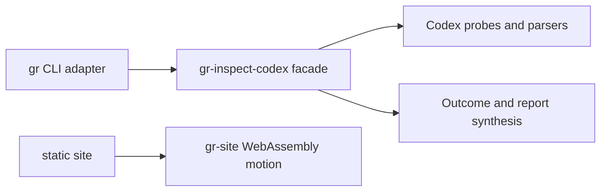

# Goalrail Architecture Spine

- Status: adopted and conforming
- Scope: the Rust workspace
- Last verified: 2026-08-09

This file records only durable, non-obvious boundaries that independent
contributors or agents could otherwise implement incompatibly. The code owns
discoverable details such as the complete file tree and internal type layout.

## Design paradigm

Goalrail is a modular monolith. The `gr` binary is a driving CLI adapter;
libraries own application behavior.

## Invariants and rules

### AD-1 — Keep the CLI thin

- **Binds:** the `gr` binary crate.
- **Prevents:** a second application layer growing inside command handlers.
- **Rule:** the CLI may parse arguments, invoke one public library use case,
  render its returned result, and map the verdict to an exit code. It must not
  sequence individual Codex probes or classify their failures.

### AD-2 — Keep inspection ownership in the library

- **Binds:** `gr-inspect-codex` inspection execution.
- **Prevents:** orchestration, error policy, and outcome construction being
  split across crates.
- **Rule:** the library owns probe sequencing, timeout and failure
  classification, and construction of complete or failed inspection outcomes.

### AD-3 — Preserve one-way owned dependencies

- **Binds:** all workspace crates.
- **Prevents:** dependency cycles and domain behavior depending on delivery
  adapters.
- **Rule:** `gr` may depend on `gr-inspect-codex`; `gr-inspect-codex` must not
  depend on `gr`. Any new owned dependency edge requires an explicit spine
  update before implementation.

### AD-4 — Expose a narrow library facade

- **Binds:** the public API of `gr-inspect-codex`.
- **Prevents:** CLI or future adapters coupling to probe, parser, discovery, or
  process-runner internals.
- **Rule:** the public surface centers on the inspection use case and its
  stable input/output types. Low-level implementation types remain private or
  `pub(crate)` unless a separate consumer justifies exporting them.

### AD-5 — Keep the public site progressively enhanced

- **Binds:** the `gr-site` crate and its static public files.
- **Prevents:** repository truth, installation guidance, or core content from
  becoming invisible to agents, crawlers, or browsers without WebAssembly.
- **Rule:** semantic HTML and checked-in status data own the complete public
  message. `gr-site` may enhance motion only, must have a browser fallback, and
  must not depend on `gr` or `gr-inspect-codex`.

## Current conformance

- AD-1: `gr` parses the command, invokes `inspect_codex`, renders the opaque
  outcome, and maps its verdict to an exit code. It does not access probes.
- AD-2: `gr-inspect-codex::use_case` owns probe sequencing, failure
  classification, outcome construction, and report formatting.
- AD-3: Cargo metadata shows the single owned dependency edge
  `gr -> gr-inspect-codex`.
- AD-4: the library facade exports only `inspect_codex`, `InspectionOutcome`,
  and `Verdict`. Probe and report internals are `pub(crate)`, and
  `#![deny(unreachable_pub)]` rejects accidental unreachable public items.

The compiler and pre-push Clippy check enforce visibility and dependency
validity. Unit and CLI integration tests protect the observable inspection
contract. AD-1 and AD-2 remain semantic ownership rules: add a focused
architecture check when another CLI use case makes manual review ambiguous.

## Decision record

- **Context:** tests can pass while responsibilities and public boundaries
  gradually become tangled.
- **Considered:** keep the rules in `AGENTS.md`; install a full SDD or BMAD
  workflow; keep one standalone architecture spine.
- **Decision:** use this standalone spine and enforce its rules with native
  compiler and repository checks as those checks become concrete.
- **Rejected:** `AGENTS.md` would mix durable architecture with operating
  instructions; a full workflow would introduce premature files and tools.
- **Rollback:** delete this file; it has no runtime or tooling dependency.
- **Revisit:** when a fourth owned crate is introduced, the site needs runtime
  application data, a public contract changes, or a rule cannot be enforced
  with the compiler and existing tests.
