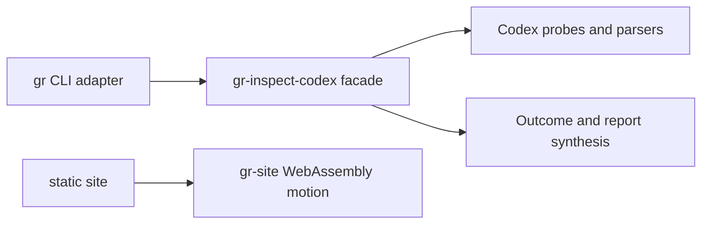

# Goalrail Architecture Spine

- Status: adopted; AD-6 remediation pending
- Scope: the Rust workspace
- Last verified: 2026-08-10

This file records only durable, non-obvious boundaries that independent
contributors or agents could otherwise implement incompatibly. The code owns
discoverable details such as the complete file tree and internal type layout.

## Design paradigm

Goalrail is a modular monolith. The `gr` binary is a driving CLI adapter;
libraries own application behavior.

## Invariants and rules

### AD-1 — Keep the CLI thin

- **Binds:** the `gr` binary crate.
- **Prevents:** a second application layer growing inside command handlers.
- **Rule:** the CLI may parse arguments, invoke one public library use case,
  render its returned result, and map the verdict to an exit code. It must not
  sequence individual Codex probes or classify their failures.

### AD-2 — Keep inspection ownership in the library

- **Binds:** `gr-inspect-codex` inspection execution.
- **Prevents:** orchestration, error policy, and outcome construction being
  split across crates.
- **Rule:** the library owns probe sequencing, timeout and failure
  classification, and construction of complete or failed inspection outcomes.

### AD-3 — Preserve one-way owned dependencies

- **Binds:** all workspace crates.
- **Prevents:** dependency cycles and domain behavior depending on delivery
  adapters.
- **Rule:** `gr` may depend on `gr-inspect-codex`; `gr-inspect-codex` must not
  depend on `gr`. Any new owned dependency edge requires an explicit spine
  update before implementation.

### AD-4 — Expose a narrow library facade

- **Binds:** the public API of `gr-inspect-codex`.
- **Prevents:** CLI or future adapters coupling to probe, parser, discovery, or
  process-runner internals.
- **Rule:** the public surface centers on the inspection use case and its
  stable input/output types. Low-level implementation types remain private or
  `pub(crate)` unless a separate consumer justifies exporting them.

### AD-5 — Keep the public site progressively enhanced

- **Binds:** the `gr-site` crate and its static public files.
- **Prevents:** repository truth, installation guidance, or core content from
  becoming invisible to agents, crawlers, or browsers without WebAssembly.
- **Rule:** semantic HTML and checked-in status data own the complete public
  message. `gr-site` may enhance motion only, must have a browser fallback, and
  must not depend on `gr` or `gr-inspect-codex`.

### AD-6 — Keep skill evidence acquisition policy-free

- **Binds:** internal skill inspection modules inside `gr-inspect-codex`.
- **Prevents:** Codex RPC and retained-rollout parsing changing when cleanup
  policy, verdict rules, or rendering changes.
- **Rule:** catalog and usage-history acquisition produce neutral evidence and
  must not depend on assessment, cleanup, findings, verdicts, item views, or
  presentation. Assessment consumes normalized evidence but performs no
  process, environment, filesystem, clock, or rendering work. Presentation
  consumes assessment output and does not acquire evidence. The skills use
  case alone sequences these stages.

The accepted internal dependency direction is `catalog -> model`,
`history -> model`, `assessment -> model`, and
`presentation -> assessment`; the orchestrator may depend on every stage. All
reverse stage edges are forbidden. The evidence and rationale are preserved in
[decision 0005](docs/decisions/0005-propose-skill-evidence-assessment-boundary.md).

## Current conformance

- AD-1: `gr` parses the command, invokes `inspect_codex`, renders the opaque
  outcome, and maps its verdict to an exit code. It does not access probes.
- AD-2: the summary and skills use cases inside `gr-inspect-codex` own probe
  sequencing, failure classification, outcome construction, and report
  formatting.
- AD-3: Cargo metadata shows the single owned dependency edge
  `gr -> gr-inspect-codex`.
- AD-4: the library facade exports the summary and skills inspection use cases,
  their opaque outcomes, and `Verdict`. Probe and report internals are
  `pub(crate)`, and `#![deny(unreachable_pub)]` rejects accidental unreachable
  public items.
- AD-5: `gr-site` has no owned dependency edge and its checked-in HTML owns the
  complete public message without WebAssembly.
- AD-6: **REVIEW**. `skills.rs` still combines catalog and history acquisition,
  cleanup assessment, filesystem-backed origin normalization, report
  construction, and presentation. The accepted boundary is not yet expressed
  as internal modules, so no semantic dependency graph exists to prove.

The compiler and pre-push Clippy check enforce visibility and dependency
validity. Unit and CLI integration tests protect the observable inspection
contract. AD-1 and AD-2 remain semantic ownership rules: add a focused
architecture check when another CLI use case makes manual review ambiguous.

## Architecture fitness v0 [TRIAL]

`mise run architecture` is the executable counterpart to the current spine.
It fails when the owned workspace members or dependency edges change without a
reviewed architecture update, when the source-level public facade snapshot or
`Verdict` variants drift, or when the provisional AD-6 canary detects a pinned
forbidden case. It prints one result per AD and an aggregate result so agents
can see both the exact boundary and the gate verdict. The current aggregate is
`REVIEW`, with a successful exit, because AD-6 is accepted but not yet
implemented.

The command also prints a separate advisory architecture-trend result. It uses
relative source-size outliers and three-revision growth in source lines and
top-level items to surface cumulative hotspots as `REVIEW`. This observation
does not fail CI or establish a module boundary; it provides evidence for the
next architecture decision. `PASS` for the hard checks must not be read as
`NO_REVIEW_SIGNAL` for the trend check.

The v0 automation is intentionally incomplete:

- AD-1 and AD-2 remain manual semantic ownership checks;
- AD-3 checks the exact Cargo workspace and owned dependency graph;
- AD-4 combines `#![deny(unreachable_pub)]` with a normalized snapshot of every
  literal public declaration, including full signatures, across the library
  source tree;
- AD-5 checks that `gr-site` has no owned dependency edge, while the existing
  site smoke tests protect its public artifact.
- AD-6 provisionally rejects a partial or unclassified skills-module topology,
  missing top-level declarations, forbidden source imports between the accepted
  stages, and process, environment, filesystem, clock, or rendering tokens in
  assessment. Positive, lexical and conditional declaration-spoof,
  forbidden-edge, and per-category purity fixtures pin that behavior.

The AD-6 source checker is deliberately unable to return `PASS`. A conforming
source fixture remains `REVIEW` until a semantic module-graph canary proves the
same dependency edges. This prevents text matching from being reported as
architectural proof while still exposing the current problem in every receipt.

File length, coupling counts, and complexity are observations rather than hard
limits. `skills.rs` remains a cohesion hotspot and AD-6 now names its missing
internal dependency boundary; the trend receipt must remain `REVIEW` until the
boundary is implemented and measured without rebaselining. Trial observations
and the revisit decision are recorded in
[`docs/trials.md`](docs/trials.md#architecture-fitness-v0).

## Decision record

- **Context:** tests can pass while responsibilities and public boundaries
  gradually become tangled.
- **Considered:** keep the rules in `AGENTS.md`; install a full SDD or BMAD
  workflow; keep one standalone architecture spine.
- **Decision:** use this standalone spine and enforce its rules with native
  compiler and repository checks as those checks become concrete.
- **Rejected:** `AGENTS.md` would mix durable architecture with operating
  instructions; a full workflow would introduce premature files and tools.
- **Rollback:** remove AD-6, its checker integration, and its fixtures together
  to restore the prior AD-1-through-AD-5 trial. Deleting the complete spine and
  architecture trial remains possible because neither affects runtime data.
- **Revisit:** before the next skills behavior milestone or any split of
  `skills.rs`, replace the provisional AD-6 source canary with a semantic
  module-graph check; also revisit when a fourth owned crate is introduced, the
  site needs runtime application data, a public contract changes, or a rule
  cannot be enforced with the compiler and existing tests.
