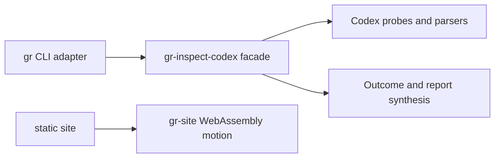

# Goalrail Architecture Spine

- Status: adopted; AD-6 remediation in progress
- Scope: the Rust workspace
- Last verified: 2026-08-11

This file records only durable, non-obvious boundaries that independent
contributors or agents could otherwise implement incompatibly. The code owns
discoverable details such as the complete file tree and internal type layout.

## Design paradigm

Goalrail is a modular monolith. The `gr` binary is a driving CLI adapter;
libraries own application behavior.

## Invariants and rules

### AD-1 — Keep the CLI thin

- **Binds:** the `gr` binary crate.
- **Prevents:** a second application layer growing inside command handlers.
- **Rule:** the CLI may parse arguments, invoke one public library use case,
  render its returned result, and map the verdict to an exit code. It must not
  sequence individual Codex probes or classify their failures.

### AD-2 — Keep inspection ownership in the library

- **Binds:** `gr-inspect-codex` inspection execution.
- **Prevents:** orchestration, error policy, and outcome construction being
  split across crates.
- **Rule:** the library owns probe sequencing, timeout and failure
  classification, and construction of complete or failed inspection outcomes.

### AD-3 — Preserve one-way owned dependencies

- **Binds:** all workspace crates.
- **Prevents:** dependency cycles and domain behavior depending on delivery
  adapters.
- **Rule:** `gr` may depend on `gr-inspect-codex`; `gr-inspect-codex` must not
  depend on `gr`. Any new owned dependency edge requires an explicit spine
  update before implementation.

### AD-4 — Expose a narrow library facade

- **Binds:** the public API of `gr-inspect-codex`.
- **Prevents:** CLI or future adapters coupling to probe, parser, discovery, or
  process-runner internals.
- **Rule:** the public surface centers on the inspection use case and its
  stable input/output types. Low-level implementation types remain private or
  `pub(crate)` unless a separate consumer justifies exporting them.

### AD-5 — Keep the public site progressively enhanced

- **Binds:** the `gr-site` crate and its static public files.
- **Prevents:** repository truth, installation guidance, or core content from
  becoming invisible to agents, crawlers, or browsers without WebAssembly.
- **Rule:** semantic HTML and checked-in status data own the complete public
  message. `gr-site` may enhance motion only, must have a browser fallback, and
  must not depend on `gr` or `gr-inspect-codex`.

### AD-6 — Keep skill evidence acquisition policy-free

- **Binds:** internal skill inspection modules inside `gr-inspect-codex`.
- **Prevents:** Codex RPC and retained-rollout parsing changing when cleanup
  policy, verdict rules, or rendering changes.
- **Rule:** catalog and usage-history acquisition produce neutral evidence and
  must not depend on assessment, cleanup, findings, verdicts, item views, or
  presentation. Assessment consumes normalized evidence but performs no
  process, environment, filesystem, clock, or rendering work. Presentation
  consumes assessment output and does not acquire evidence. The skills use
  case alone sequences these stages.

The accepted internal dependency direction is `catalog -> model`,
`history -> model`, `assessment -> model`, and
`presentation -> assessment`; the orchestrator may depend on every stage. All
reverse stage edges are forbidden. The evidence and rationale are preserved in
[decision 0005](docs/decisions/0005-propose-skill-evidence-assessment-boundary.md).

## Current conformance

- AD-1: `gr` parses the command, invokes `inspect_codex`, renders the opaque
  outcome, and maps its verdict to an exit code. It does not access probes.
- AD-2: the summary and skills use cases inside `gr-inspect-codex` own probe
  sequencing, failure classification, outcome construction, and report
  formatting.
- AD-3: Cargo metadata shows the single owned dependency edge
  `gr -> gr-inspect-codex`.
- AD-4: the library facade exports the summary and skills inspection use cases,
  their opaque outcomes, and `Verdict`. Probe and report internals are
  `pub(crate)`, and `#![deny(unreachable_pub)]` rejects accidental unreachable
  public items.
- AD-5: `gr-site` has no owned dependency edge and its checked-in HTML owns the
  complete public message without WebAssembly.
- AD-6: **REVIEW**. Neutral assessment input types now live in `skills/model.rs`
  and cleanup policy lives in the pure `skills/assessment.rs` stage. The
  orchestrator normalizes filesystem-backed origins before assessment. Catalog,
  history, and presentation remain in `skills.rs`, so the complete five-stage
  graph is not yet extracted.

The compiler and pre-push Clippy check enforce visibility and Cargo dependency
validity. Unit and CLI integration tests protect the observable inspection
contract. These checks do not prove semantic ownership or the complete AD-6
stage graph.

## Enforcement status

The custom architecture-fitness trial was removed on 2026-08-11 after repeated
false accepts, false rejects, runtime incompatibility, and expansion into an
unsupported Ruby parser for Rust source and compiler output. Its scripts,
fixtures, and CI tasks no longer exist. The decision and retained evidence are
recorded in [decision 0004](docs/decisions/0004-trial-native-architecture-fitness.md)
and [`docs/trials.md`](docs/trials.md#architecture-fitness-v0).

AD-1 through AD-6 still require explicit review; CI must not claim automated
architecture conformance. The separate `architecture:public-api` trial detects
only the rustdoc-visible facade slice recorded in
[decision 0006](docs/decisions/0006-trial-cargo-public-api.md). Repository-owned
Ruby tooling is prohibited, except for Homebrew's required Formula DSL. A
future gate should prefer a mature maintained compiler-aware library or tool.
Focused project-specific rules remain allowed when they state only what they
can prove and pass positive and negative sabotage cases. Any gate claiming the
complete AD-6 dependency graph or assessment-purity constraints must prove
those exact claims before entering CI.

Revisit enforcement before the next AD-6 stage extraction or skills behavior
milestone, when another owned crate is introduced, when the public API changes,
or when the site needs runtime application data.
