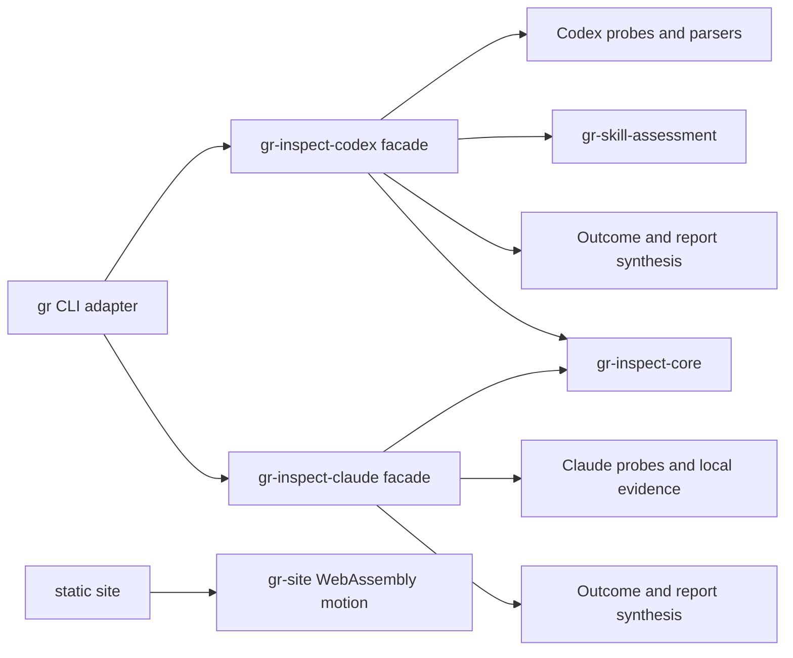

# Goalrail Architecture

- Status: adopted; AD-6 assessment boundary enforced, remaining stages review-only
- Scope: the Rust workspace
- Last verified: 2026-08-13

This file records the architecture spine: only durable, non-obvious boundaries
that independent contributors or agents could otherwise implement
incompatibly. The code owns
discoverable details such as the complete file tree and internal type layout.

## Design paradigm

Goalrail is a modular monolith. The `gr` binary is a driving CLI adapter;
libraries own application behavior.

## Invariants and rules

### AD-1 — Keep the CLI thin

- **Binds:** the `gr` binary crate.
- **Prevents:** a second application layer growing inside command handlers.
- **Rule:** the CLI may parse arguments, invoke one public library use case,
  render its returned result, and map the verdict to an exit code. It must not
  sequence individual Codex probes or classify their failures.

### AD-2 — Keep inspection ownership in the library

- **Binds:** `gr-inspect-codex` and `gr-inspect-claude` inspection execution.
- **Prevents:** orchestration, error policy, and outcome construction being
  split across crates.
- **Rule:** the library owns probe sequencing, timeout and failure
  classification, and construction of complete or failed inspection outcomes.

### AD-3 — Preserve one-way owned dependencies

- **Binds:** all workspace crates.
- **Prevents:** dependency cycles and domain behavior depending on delivery
  adapters.
- **Rule:** the accepted owned edges are exactly `gr -> gr-inspect-codex`,
  `gr -> gr-inspect-claude`, `gr -> gr-inspect-core`,
  `gr-inspect-codex -> gr-inspect-core`,
  `gr-inspect-codex -> gr-skill-assessment`, and
  `gr-inspect-claude -> gr-inspect-core`. No edge may be reversed, and the two
  inspection libraries must not depend on each other, so one agent's evidence
  contract cannot reach the other except through the agent-neutral core.
  `gr-skill-assessment` may depend only on third-party serialization support and
  the Rust `core`/`alloc` surface. Any new owned dependency edge requires an
  explicit spine update before implementation.

### AD-4 — Expose a narrow library facade

- **Binds:** the public API of `gr-inspect-codex` and `gr-inspect-claude`.
- **Prevents:** CLI or future adapters coupling to probe, parser, discovery, or
  process-runner internals.
- **Rule:** the public surface centers on the inspection use case and its
  stable input/output types. Low-level implementation types remain private or
  `pub(crate)` unless a separate consumer justifies exporting them.

### AD-5 — Keep the public site progressively enhanced

- **Binds:** the `gr-site` crate and its static public files.
- **Prevents:** repository truth, installation guidance, or core content from
  becoming invisible to agents, crawlers, or browsers without WebAssembly.
- **Rule:** semantic HTML and checked-in status data own the complete public
  message. `gr-site` may enhance motion only, must have a browser fallback, and
  must not depend on `gr` or `gr-inspect-codex`.

### AD-6 — Keep skill evidence acquisition policy-free

- **Binds:** skill inspection stages across `gr-inspect-codex` and the internal
  `gr-skill-assessment` crate.
- **Prevents:** Codex RPC and retained-rollout parsing changing when cleanup
  policy, verdict rules, or rendering changes.
- **Rule:** catalog and usage-history acquisition produce neutral evidence and
  must not depend on assessment, cleanup, findings, verdicts, item views, or
  presentation. Assessment consumes normalized evidence but performs no
  process, environment, filesystem, clock, or rendering work. Presentation
  consumes assessment output and does not acquire evidence. One internal skill
  evidence service sequences these stages; use cases may consume narrow
  assessed projections without reimplementing acquisition or assessment.

### AD-7 — Keep the shared inspection core agent-neutral

- **Binds:** `gr-inspect-core`.
- **Prevents:** one agent's probe vocabulary, report schema, or evidence policy
  reaching the other inspection library through shared code.
- **Rule:** the core owns only the bounded process runner, the shared `Verdict`
  contract, and exit-code formatting. It must not name Codex or Claude
  commands, paths, report shapes, findings, cleanup policy, or evidence bases,
  and it must not depend on any other workspace crate.

### AD-8 — Keep Claude inspection to documented, locally observable evidence

- **Binds:** `gr-inspect-claude`.
- **Prevents:** an inspection that infers Claude Code state from undocumented
  files or that reports a diagnostic Claude Code does not expose.
- **Rule:** evidence comes only from `claude --version`, the native
  `claude plugin list --json` and `claude plugin marketplace list --json`
  surfaces, and the documented configuration paths under the resolved Claude
  home. The command is read-only. Where Claude Code exposes no machine-readable
  surface, the report states the gap in `evidenceLimitations` instead of
  parsing human output, guessing an undocumented file, or omitting the subject.

The accepted internal dependency direction is `catalog -> assessment model`,
`history -> assessment model`, and `presentation -> assessment output`; the
orchestrator may depend on every stage. Model and assessment policy are owned by
`gr-skill-assessment`, which cannot depend on the acquisition, presentation, or
orchestration crate. All reverse stage edges are forbidden. The evidence and
rationale are preserved in [decision 0005](docs/decisions/0005-propose-skill-evidence-assessment-boundary.md)
and [decision 0008](docs/decisions/0008-enforce-skill-assessment-crate-boundary.md).

## Current conformance

- AD-1: `gr` parses each command, invokes one inspection use case, renders its
  opaque outcome, and maps the verdict to an exit code. It does not access probes.
- AD-2: the summary, skills, and plugins use cases inside `gr-inspect-codex` and
  the summary use case inside `gr-inspect-claude` own probe sequencing, failure
  classification, outcome construction, and report formatting.
- AD-3: Cargo metadata shows only the owned dependency edges
  `gr -> gr-inspect-codex`, `gr -> gr-inspect-claude`, `gr -> gr-inspect-core`,
  `gr-inspect-codex -> gr-inspect-core`,
  `gr-inspect-codex -> gr-skill-assessment`, and
  `gr-inspect-claude -> gr-inspect-core`. The `architecture:assessment` task in
  CI compares that exact set.
- AD-4: each library facade exports its inspection use cases and their opaque
  outcomes; `Verdict` is owned and exported by `gr-inspect-core`, and each
  adapter imports it from there rather than through a re-export. Probe and
  report internals are `pub(crate)`, and `#![deny(unreachable_pub)]` rejects
  accidental unreachable public items. The `architecture:public-api` trial pins
  both inspection facades, `gr-inspect-codex` at 17 items and
  `gr-inspect-claude` at 8; a facade absent from the trial's package list is not
  checked, so adding an inspection library means adding it there.
- AD-5: `gr-site` has no owned dependency edge and its checked-in HTML owns the
  complete public message without WebAssembly.
- AD-6: **REVIEW**. Neutral assessment input types and cleanup policy live in
  the internal `no_std` crate `gr-skill-assessment`. The orchestrator normalizes
  filesystem-backed origins and path values before assessment. Cargo enforces
  that assessment cannot depend back on acquisition or presentation. Catalog,
  history, plugin-skill projection, and skills presentation remain in
  `skills.rs`, so the complete five-stage graph is not yet extracted. The
  plugins use case consumes only the assessed plugin-skill projection and does
  not read the catalog or retained rollouts itself.
- AD-7: `gr-inspect-core` contains the bounded process runner, `Verdict`, and
  exit-code formatting only, and Cargo metadata shows it with no owned
  dependency of its own.
- AD-8: **REVIEW**. The Claude summary runs only the three native commands
  named in the rule and reads only the resolved Claude home, `~/.claude.json`,
  the project `.mcp.json`, `CLAUDE.md` sources, and `SKILL.md` manifests. Unit
  and CLI integration tests cover unavailable, malformed, and absent evidence,
  and one CLI test compares a Claude home snapshot before and after a run to
  prove the command writes nothing. No check proves that a future probe stays
  inside the documented surface; that remains a review obligation.

The compiler and pre-push Clippy check enforce visibility and Cargo dependency
validity. Unit and CLI integration tests protect the observable inspection
contract. These checks do not prove semantic ownership or the complete AD-6
stage graph.

## Enforcement status

The custom architecture-fitness trial was removed on 2026-08-11 after repeated
false accepts, false rejects, runtime incompatibility, and expansion into an
unsupported Ruby parser for Rust source and compiler output. Its scripts,
fixtures, and CI tasks no longer exist. The decision and retained evidence are
recorded in [decision 0004](docs/decisions/0004-trial-native-architecture-fitness.md)
and [`docs/trials.md`](docs/trials.md#architecture-fitness-v0).

AD-1 through AD-8 still require explicit review; CI must not claim complete
automated architecture conformance. The `architecture:assessment` task proves
only the owned dependency and `no_std` constraints stated in decision 0008,
extended in [decision 0014](docs/decisions/0014-add-claude-inspection-crate.md)
to the exact five-edge set that admits `gr-inspect-claude` and
`gr-inspect-core`.
The separate `architecture:public-api` trial detects only the rustdoc-visible facade slice recorded in
[decision 0006](docs/decisions/0006-trial-cargo-public-api.md). Repository-owned
Ruby tooling is prohibited, except for Homebrew's required Formula DSL. A
future gate should prefer a mature maintained compiler-aware library or tool.
Focused project-specific rules remain allowed when they state only what they
can prove and pass positive and negative sabotage cases. Any gate claiming the
complete AD-6 dependency graph or assessment-purity constraints must prove
those exact claims before entering CI.

`[TRIAL: identity-based-architecture-drift]` The manually invoked
`architecture:drift` task compares exact Cargo workspace members and owned
edges, the current pinned rustdoc-visible facade, and per-file Rust source line
counts and content fingerprints with an accepted snapshot. It reports
`NO_CHANGE` or advisory `REVIEW`;
neither verdict proves architecture conformance. The contract and its limits
are recorded in
[decision 0009](docs/decisions/0009-trial-identity-based-architecture-drift.md).

`cargo-pup` 0.1.8 was evaluated and rejected as a dependency-direction gate:
it rejected a forbidden `use` declaration but accepted the same dependency
through a qualified path. The evidence and revisit condition are recorded in
[decision 0007](docs/decisions/0007-reject-cargo-pup-dependency-gate.md).

`[TRIAL: compiler-enforced-skill-assessment-boundary]` The current
compiler-enforced assessment boundary and its deliberately narrow claim are recorded in
[decision 0008](docs/decisions/0008-enforce-skill-assessment-crate-boundary.md).

Revisit enforcement before the next AD-6 stage extraction or skills behavior
milestone, when another owned crate is introduced, when the public API changes,
or when the site needs runtime application data.
