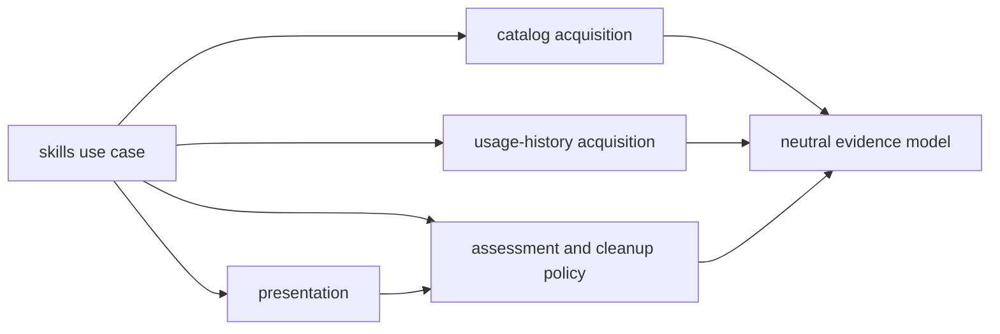

# Propose a Skill Evidence-to-Assessment Boundary

- **Status:** adopted; first Rust extraction implemented
- **Date:** 2026-08-10
- **Decision owner:** t3chn
- **Owner decision:** accepted on 2026-08-10
- **Implementation authority:** the owner separately authorized the first pure
  assessment extraction on 2026-08-10

## Decision Question

Which internal boundary explains the current `skills.rs` hotspot, follows the
observed change history, and can be protected without changing the public CLI or
library contract?

## Pre-extraction Verified Evidence

The retired architecture trend canary reported `skills.rs` as `REVIEW`: source
lines grew `2763 -> 3104 -> 3208` and top-level items grew `81 -> 86 -> 91`.
At that point the file contained 1,569 production lines and 1,639 colocated test
lines.
Moving tests alone could clear a size signal without improving production
dependencies, so that is not an architectural resolution.

At decision time, the production code combined these responsibilities:

| Responsibility | Pre-extraction evidence |
| --- | --- |
| Facade and orchestration | Public outcomes and views plus `inspect_codex_skills_inner`, which sequenced every stage |
| Catalog acquisition | Codex app-server process, RPC transport, response parsing, and CWD selection |
| Usage evidence | Rollout discovery, JSONL parsing, exact manifest matching, deduplication, and coverage counters |
| Assessment and cleanup policy | Coverage sufficiency, origin and signal classification, cleanup disposition, sorting, findings, and verdict |
| Presentation | Serializable report shape, item filtering, JSON delegation, and human table rendering |
| Time support | RFC 3339 parsing and formatting plus calendar conversion |

Before the extraction, the strongest coupling was in `build_report`: it
consumed catalog and usage evidence, instantiated `SkillOriginClassifier`,
performed filesystem canonicalization indirectly, applied cleanup policy,
created findings and the verdict, sorted presentation rows, and constructed the
serialized report.

The first extraction now places the neutral assessment input model in
`skills/model.rs` and cleanup policy in the pure `skills/assessment.rs` stage.
The orchestrator normalizes filesystem-backed origins before calling
assessment. Catalog, history, presentation, time support, and orchestration
remain in `skills.rs`; the complete five-stage graph is not yet extracted.

The history separates downstream reasons to change from acquisition:

- `b8f5d56` added cleanup ownership policy, findings, ordering, output fields,
  rendering, and tests without changing catalog RPC or rollout scanning.
- `84c9e8e` added actionable filtering, a public view, output metadata,
  rendering, and tests without changing catalog RPC or rollout scanning.

This is evidence for an acquisition-to-assessment seam. It is not yet evidence
for separate crates or a changed public API.

## Options

### 1. Split the file mechanically

Move tests and contiguous line ranges into smaller files. This reduces the
trend metric but does not define dependency direction and can preserve the
current mixed `build_report`. Rejected as the architecture decision.

### 2. Separate pipeline stages

Use a neutral internal model with catalog and retained-history acquisition
producing evidence, a pure assessment stage consuming that evidence, and
presentation consuming the assessment. The existing use case remains the
orchestrator. Selected and owner-accepted because it matches both the call flow
and the independent change history.

### 3. Split `all` and `actionable` into separate use cases

Give each view its own acquisition and report path. Rejected because both views
share evidence and cleanup policy; separate paths would duplicate orchestration
and weaken AD-2.

## Accepted AD-6 Boundary — Keep Evidence Acquisition Policy-Free

- **Binds:** internal skill inspection modules inside `gr-inspect-codex`.
- **Prevents:** Codex RPC and retained-rollout parsing changing when cleanup
  policy, verdict rules, or rendering changes.
- **Rule:** catalog and usage-history acquisition may produce neutral evidence
  only. They must not depend on assessment, cleanup, findings, verdict, item
  views, or presentation. Assessment may consume normalized catalog and usage
  evidence but must not perform process, environment, filesystem, clock, or
  rendering work. Presentation may consume assessment output and must not
  acquire evidence. The skills use case owns sequencing across the stages.

Allowed compile-time dependencies:

Allowed internal dependency direction:

- `model` depends on none of the other skill stages;
- `catalog` and `history` may depend on `model` and bounded infrastructure;
- `assessment` may depend on `model` and stable shared verdict/finding value
  types, but on no other skill stage;
- `presentation` may depend on assessment output;
- the skills orchestrator may depend on every stage;
- all reverse edges are forbidden.

## Future Fitness Test Specification

Any future automated AD-6 gate should prefer a mature, maintained,
compiler-aware library or tool selected against this exact boundary. It must
build the skills stage dependency graph, reject reverse edges, and detect
process, environment, filesystem, clock, or rendering effects in assessment.
Positive and negative sabotage cases must prove those claims before the gate
enters CI.

Repository-owned Ruby tooling is prohibited except for Homebrew Formula DSL.
A focused project-specific rule in the repository's implementation language is
allowed, but its mechanism and claim must match: text or compiler-output checks
must not be described as complete semantic proof. Until a suitable gate is
selected, AD-6 conformance is established by explicit independent and
self-review, not an automated `PASS` claim.

## Smallest Reversible Canary

The first separately authorized Rust extraction moves only the neutral
assessment input model and pure cleanup policy. Origin normalization remains in
the orchestrator before assessment, so assessment does not call
`fs::canonicalize`. The public API, serialized schema, human output, verdicts,
and evidence semantics remain unchanged. Catalog, history, and presentation
stay in `skills.rs` until later bounded extractions.

The historical pre-fix `REVIEW` receipt remains evidence for this boundary even
though the custom architecture trial that produced it has been removed.

## Material Unknowns and Objections

- The current history has only three revisions of `skills.rs`; it supports a
  candidate seam, not a final module topology.
- Rename-heavy or shallow Git history can weaken the historical trend evidence.
- No mature replacement tool has yet been selected or shown to enforce the
  complete AD-6 graph and assessment-purity rule.
- More modules add navigation cost. The accepted boundary justifies that cost
  only for a protected dependency direction, not for smaller files by
  themselves.

## Owner Decision and Rollback

The owner accepted the AD-6 boundary and separately authorized its first pure
assessment extraction on 2026-08-10.

Rollback of the first Rust extraction moves the pure assessment types and
policy back into `skills.rs`; it has no runtime, schema, dependency, or
deployment effect. AD-6 remains the durable owner-accepted boundary unless the
owner changes it separately.

## Revisit Condition

Evaluate a mature compiler-aware enforcement tool before the next AD-6 stage
extraction or skills behavior milestone. Complete the remaining extraction only
in bounded, separately closed milestones.
