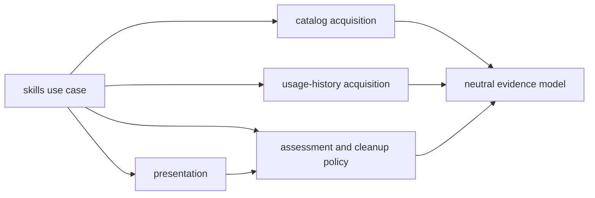

# Propose a Skill Evidence-to-Assessment Boundary

- **Status:** adopted; Rust remediation pending
- **Date:** 2026-08-10
- **Decision owner:** t3chn
- **Owner decision:** accepted on 2026-08-10
- **Implementation authority:** the spine and provisional fitness fixtures are
  authorized; no Rust refactor is authorized by this decision

## Decision Question

Which internal boundary explains the current `skills.rs` hotspot, follows the
observed change history, and can be protected without changing the public CLI or
library contract?

## Verified Evidence

The architecture trend canary reports `skills.rs` as `REVIEW`: source lines
grow `2763 -> 3104 -> 3208` and top-level items grow `81 -> 86 -> 91`. The
current file contains 1,569 production lines and 1,639 colocated test lines.
Moving tests alone could clear a size signal without improving production
dependencies, so that is not an architectural resolution.

The production code currently combines these responsibilities:

| Responsibility | Current evidence |
| --- | --- |
| Facade and orchestration | Public outcomes and views plus `inspect_codex_skills_inner`, which sequences every stage (`skills.rs:42-139`, `546-607`) |
| Catalog acquisition | Codex app-server process, RPC transport, response parsing, and CWD selection (`skills.rs:351-409`, `658-820`) |
| Usage evidence | Rollout discovery, JSONL parsing, exact manifest matching, deduplication, and coverage counters (`skills.rs:409-545`, `821-1174`) |
| Assessment and cleanup policy | Coverage sufficiency, origin and signal classification, cleanup disposition, sorting, findings, and verdict (`skills.rs:140-350`, `1175-1395`) |
| Presentation | Serializable report shape, item filtering, JSON delegation, and human table rendering (`skills.rs:52-200`, `1516-1568`) |
| Time support | RFC 3339 parsing and formatting plus calendar conversion (`skills.rs:1396-1515`) |

The strongest current coupling is in `build_report`: it consumes catalog and
usage evidence, instantiates `SkillOriginClassifier`, performs filesystem
canonicalization indirectly, applies cleanup policy, creates findings and the
verdict, sorts presentation rows, and constructs the serialized report.

The history separates downstream reasons to change from acquisition:

- `b8f5d56` added cleanup ownership policy, findings, ordering, output fields,
  rendering, and tests without changing catalog RPC or rollout scanning.
- `84c9e8e` added actionable filtering, a public view, output metadata,
  rendering, and tests without changing catalog RPC or rollout scanning.

This is evidence for an acquisition-to-assessment seam. It is not yet evidence
for separate crates or a changed public API.

## Options

### 1. Split the file mechanically

Move tests and contiguous line ranges into smaller files. This reduces the
trend metric but does not define dependency direction and can preserve the
current mixed `build_report`. Rejected as the architecture decision.

### 2. Separate pipeline stages

Use a neutral internal model with catalog and retained-history acquisition
producing evidence, a pure assessment stage consuming that evidence, and
presentation consuming the assessment. The existing use case remains the
orchestrator. Selected and owner-accepted because it matches both the call flow
and the independent change history.

### 3. Split `all` and `actionable` into separate use cases

Give each view its own acquisition and report path. Rejected because both views
share evidence and cleanup policy; separate paths would duplicate orchestration
and weaken AD-2.

## Accepted AD-6 Boundary — Keep Evidence Acquisition Policy-Free

- **Binds:** internal skill inspection modules inside `gr-inspect-codex`.
- **Prevents:** Codex RPC and retained-rollout parsing changing when cleanup
  policy, verdict rules, or rendering changes.
- **Rule:** catalog and usage-history acquisition may produce neutral evidence
  only. They must not depend on assessment, cleanup, findings, verdict, item
  views, or presentation. Assessment may consume normalized catalog and usage
  evidence but must not perform process, environment, filesystem, clock, or
  rendering work. Presentation may consume assessment output and must not
  acquire evidence. The skills use case owns sequencing across the stages.

Allowed compile-time dependencies:

Allowed internal dependency direction:

- `model` depends on none of the other skill stages;
- `catalog` and `history` may depend on `model` and bounded infrastructure;
- `assessment` may depend on `model` and stable shared verdict/finding value
  types, but on no other skill stage;
- `presentation` may depend on assessment output;
- the skills orchestrator may depend on every stage;
- all reverse edges are forbidden.

## Future Fitness Test Specification

After the modules exist, the final `AD-6` check must build the semantic dependency
graph for the skills subtree and compare it with the allowed edges above. A
negative fixture must add a dependency from history acquisition to
`CleanupDisposition` or presentation and receive `AD-6: FAILED`. A positive
fixture must preserve the allowed pipeline and pass. The check belongs in
`mise run architecture` and must report its AD result independently.

A second negative fixture must add process, environment, filesystem, clock, or
rendering use to assessment and fail. This protects the purity part of the rule
that an internal module graph alone may not represent.

The adoption milestone adds a provisional repository-native source checker. It
rejects a partial or unclassified stage topology, pinned forbidden imports, and
assessment purity violations. Lexical and conditional declaration-spoof plus
per-category purity fixtures pin its fail-closed behavior. Its positive fixture
remains `AD-6: REVIEW`; the checker cannot report `PASS` until a semantic module
graph proves the same edges. File length, module names, and text matching are
not acceptable substitutes for that final dependency check.

## Smallest Reversible Canary

The separately authorized adoption milestone updates
`ARCHITECTURE-SPINE.md`, makes every architecture receipt report AD-6
explicitly, and adds positive, forbidden-edge, and assessment-purity fixtures.
It does not move Rust code. The first later extraction should move only the
pure assessment seam. Origin normalization must happen before assessment so
the assessment code does not call `fs::canonicalize`. Preserve the current
public API, serialized schema, human output, verdicts, and evidence semantics
before considering a broader catalog/history split.

The existing architecture trend may remain `REVIEW` after this canary. Do not
move or reset the pre-fix receipt merely to make the trend green.

## Material Unknowns and Objections

- The current history has only three revisions of `skills.rs`; it supports a
  candidate seam, not a final module topology.
- Rename-heavy or shallow Git history can weaken the trend evidence but does
  not affect the source-level coupling described above.
- A semantic module graph may justify a new pinned development tool. Tool
  selection remains a separate reversible canary, not part of this proposal.
- More modules add navigation cost. The accepted boundary justifies that cost
  only for a protected dependency direction, not for smaller files by
  themselves.

## Owner Decision and Rollback

The owner accepted the AD-6 boundary on 2026-08-10. The separately authorized
adoption milestone adds it to the spine and executable architecture receipt,
but does not authorize a Rust refactor.

Rollback removes AD-6 from the spine, its checker integration and fixtures,
this decision, and the associated trial-log observation as one change. It has
no runtime, schema, dependency, or deployment effect.

## Revisit Condition

Replace the provisional source checker with semantic module-graph enforcement
as part of the first skills boundary extraction, before the next skills
behavior milestone or any broader split of `skills.rs`.
