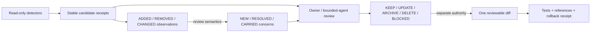

# Modern Repository Hygiene Landscape — August 2026

- Research status: **verified synthesis; independently reviewed and revised**
- Date: 2026-08-12
- Original research tree: `4217fa71e61889a131d239aad319652b61086f88`
- Current Goalrail verification tree: `83d3783c6d3d0ced6bced4c93972170c6abfdae1`
- Delve run: `20260812-modern-repository-hygiene`
- Independent architecture review: `MODIFY`, incorporated on 2026-08-12
- Depth: medium; one bounded `SCAN -> DECOMPOSE -> DIVE -> VERIFY -> SYNTHESIZE` run
- Companion report: [Repository Hygiene Lifecycle for Coding Agents](repository-hygiene-lifecycle.md)
- Out of scope: installing or executing upstream tools, changing product code or
  CI, deleting or moving files, changing release authority, committing, pushing,
  publishing, or deploying

## Short answer

There is no mature open-source product that can safely decide which code,
tests, scripts, documentation, decisions, or local artifacts are obsolete.
The strongest current projects solve narrower layers:

1. build a reachability or dependency signal;
2. compare current observations with an accepted baseline and surface only
   meaningful deltas;
3. produce a reviewable diff or pull request;
4. make executable documentation inspectable;
5. reclaim only clearly generated artifacts using explicit criteria.

Goalrail should combine those **control patterns**, not adopt another platform.
The smallest useful architecture is:



The detector may say “suspect.” It must never be able to say “delete.”

## Method and evidence boundary

### Facts

Facts below were checked against upstream source, upstream documentation, exact
clone commits, and license files on 2026-08-12. Goalrail-specific facts were
then refreshed against tree `83d3783c...`, successful native run 31572166805,
and public release `v0.3.6`. GitHub activity and star counts are time-scoped
discovery metadata, not quality evidence.

### Synthesis

Adoption, rejection, cadence, and Goalrail architecture recommendations are the
orchestrator's synthesis. They have medium confidence until a bounded canary
measures false positives, runtime, review cost, and maintenance cost here.

One research sub-agent was assigned the documentation/release lane but did not
return a payload within the bounded run after two stop requests. The
orchestrator independently verified that lane from primary sources and did not
start a second research round.

## Open-source code study receipt

Seven licensed repositories were shallow-cloned read-only into:

`/private/tmp/goalrail-hygiene-study-20260812`

No upstream code was built or executed, and no dependency was installed.

| Project | Exact studied commit | License verified locally | Why it was opened |
| --- | --- | --- | --- |
| [cargo-shear](https://github.com/Boshen/cargo-shear) | `1fdd1d97b964162cc8142c2945e18e0a54cd0f92` | MIT | Rust dependency, empty-file, and unlinked-file evidence; fix boundary |
| [cargo-machete](https://github.com/bnjbvr/cargo-machete) | `5a6550345dd59f4450caa4cf7779438e875e8914` | MIT | Fast heuristic detector; explicit false-positive warning |
| [cargo-sweep](https://github.com/holmgr/cargo-sweep) | `94a7cf012d40d314896c0fa6986132b0a1e931ba` | MIT | Selective generated-artifact deletion and dry-run |
| [Knip](https://github.com/webpro-nl/knip) | `9f18cba93c91de8554636b13692d6e7a937b7697` | ISC | Reachability graph, gradual adoption, ratchets, guarded file removal |
| [ArchUnit](https://github.com/TNG/ArchUnit) | `d9ac308e9070b12c4d4a2c50d1d2c032386bdd6a` | Apache-2.0 | Frozen-violation baseline and anti-regression ratchet |
| [OpenRewrite](https://github.com/openrewrite/rewrite) | `23216c90288827cf0e325ad8caa05c8ee0e17279` | Apache-2.0 | Deterministic recipes, before/after model, reviewable diffs |
| [Runme](https://github.com/runmedev/runme) | `5d142bcf03b7e4e75f6a52cf962a496e5ba567e1` | Apache-2.0 | Named executable Markdown cells, print, and dry-run |

Clone connectivity and all Delve JSON artifacts were verified locally. These
temporary study copies are not part of the repository and may disappear when
the host cleans `/private/tmp`.

## Landscape: what exists in August 2026

| Project or practice | What it actually solves | Write surface | Goalrail verdict | Confidence |
| --- | --- | --- | --- | --- |
| cargo-shear | Rust source/Cargo dependency difference; also warnings for empty and unlinked files; JSON findings and scoped ignores | `--fix` rewrites package and workspace manifests | **CONDITIONAL CANARY, report-only** if an observed gap justifies it | High |
| cargo-machete | Fast, deliberately imprecise unused-dependency candidates | `--fix` rewrites manifests and explicitly removes false positives too | **REFERENCE ONLY**; cargo-shear is the stronger canary | High |
| Knip | JS/TS entrypoint and module reachability, unused files/exports/dependencies, staged rules and budgets | Direct file removal and source/manifest writes in fix mode | **BORROW THE ADOPTION MODEL**, not the tool | High |
| ArchUnit `FreezingArchRule` | Existing-violation store; new violations fail; resolved ones leave the store and cannot silently return | Baseline create/update/refreeze is configurable | **BORROW THE CONTROL MODEL**, but keep Goalrail observation and concern semantics separate | High |
| OpenRewrite | Typed recipes, data tables, and per-file before/after diffs for supported languages | Recipes can create, rewrite, or delete files | **BORROW RECIPE + DIFF RECEIPTS**; no Rust adoption | High |
| Runme | Finds, prints, dry-runs, and executes named Markdown code cells | Normal run executes commands and retains session environment | **REFERENCE ONLY**: Goalrail now has a canonical runbook and focused contract checks; no executable-doc gap is demonstrated | High |
| cargo-sweep | Selective `target/` cleanup by age, toolchain, size, or timestamp with dry-run | Deletes generated build artifacts | **DO NOT ADOPT**: upstream says unmaintained | High |
| [Tach](https://github.com/tach-org/tach) | Python module dependency/interface enforcement, graph, incremental adoption | Creates configuration/graph; check is read-only | **REFERENCE ONLY**: wrong language domain | High |
| [release-plz](https://github.com/release-plz/release-plz) | Maintained Rust release PR plus tags, registry publication, and hosting releases after merge | External PR, tag, publish, and release actions | **NOT HYGIENE**; separate release-architecture decision | High |
| [Renovate](https://github.com/renovatebot/renovate) | Dependency discovery and evidence-rich update PRs across many managers | External/self-hosted scheduled repository writes | **DEFER** until update toil is a demonstrated problem | High |
| [lychee](https://github.com/lycheeverse/lychee) | Link reachability with structured output, filters, throttling, retries, and rate-limit handling | Read-only unless wrapped by external reporting workflows | **CONDITIONAL CANARY** for a demonstrated local-link gap; remote links advisory | High |
| [MegaLinter](https://github.com/oxsecurity/megalinter) | Orchestrates over one hundred linters, reporters, and optional fixes | Can modify branches or create PRs | **REJECT**: platform-sized noise and authority surface | High |

Discovery metadata at scan time showed active upstream work for all catalogued
projects except the explicit cargo-sweep maintenance warning. Popularity ranged
from focused Rust tools to large multi-language projects. Popularity did not
affect the fit verdict.

GitNexus was considered for code-graph discovery but excluded from the open-code
study because repository metadata did not establish an SPDX license during the
bounded scan. Its graph-search role also does not solve semantic deletion.

## Code-backed findings

### 1. Reachability is evidence, not authority

[cargo-shear's documentation](https://github.com/Boshen/cargo-shear/blob/1fdd1d97b964162cc8142c2945e18e0a54cd0f92/README.md)
separates report-only usage, JSON output, and `--fix`. It documents missing
macro-expanded imports without nightly expansion, limited dependency-placement
coverage, false-positive ignores, and redundant-ignore findings. Its
[implementation](https://github.com/Boshen/cargo-shear/blob/1fdd1d97b964162cc8142c2945e18e0a54cd0f92/src/lib.rs)
then confirms that fix mode removes dependencies, moves dependency tables, and
writes `Cargo.toml` files.

[cargo-machete](https://github.com/bnjbvr/cargo-machete/blob/5a6550345dd59f4450caa4cf7779438e875e8914/src/main.rs)
states the safety problem even more directly: it is “fast yet imprecise,” and
its fix mode removes every flagged dependency, including false positives.

**Implication:** Goalrail may consume structured findings from a detector. It
must not expose the detector's write mode in a hygiene workflow.

### 2. Trustworthy reachability comes before cleanup

[Knip's gradual-adoption guide](https://github.com/webpro-nl/knip/blob/9f18cba93c91de8554636b13692d6e7a937b7697/packages/docs/src/content/docs/guides/adopt-gradually.md)
says to correct missing entrypoints and plugins before deletion, then work one
issue type at a time. It supports warning/error staging, workspace scoping,
production-first analysis, current-debt budgets, report-only operation, and
specific suppressions.

Its [auto-fix guide](https://github.com/webpro-nl/knip/blob/9f18cba93c91de8554636b13692d6e7a937b7697/packages/docs/src/content/docs/features/auto-fix.mdx)
requires an additional `--allow-remove-files` switch for file removal and tells
users to rely on version control for review and undo. The
[fixer implementation](https://github.com/webpro-nl/knip/blob/9f18cba93c91de8554636b13692d6e7a937b7697/packages/knip/src/IssueFixer.ts)
performs direct `rm` and write operations once enabled.

**Implication:** adopt Knip's calibration and staged-ratchet ideas, not its
language-specific implementation or mutation path.

### 3. Baseline growth must be explicit; shrinkage must be reviewed, not assumed

[ArchUnit's documented behavior](https://github.com/TNG/ArchUnit/blob/d9ac308e9070b12c4d4a2c50d1d2c032386bdd6a/docs/userguide/008_The_Library_API.adoc)
is the strongest mature precedent found:

- the first accepted set is stored;
- later runs report only new violations;
- fixed violations are removed from the store, preventing reintroduction;
- store creation is disabled by default;
- CI can forbid store updates;
- broad refreeze is explicit and default-off.

The [implementation](https://github.com/TNG/ArchUnit/blob/d9ac308e9070b12c4d4a2c50d1d2c032386bdd6a/archunit/src/main/java/com/tngtech/archunit/library/freeze/FreezingArchRule.java)
categorizes known/current/solved violations, updates the store only for solved
items during normal evaluation, and returns only unknown violations.

**Implication:** Goalrail architecture/drift acceptance must not be “copy the
latest snapshot.” ArchUnit's control model is useful, but its violations are
already semantic rule failures while Goalrail's drift entries are observations.
Goalrail therefore needs two layers:

- baseline comparison emits `ADDED_OBSERVATION`, `REMOVED_OBSERVATION`, and
  `CHANGED_OBSERVATION`;
- review may classify those as `NEW_CONCERN`, `RESOLVED_CONCERN`,
  `CARRIED_CONCERN`, or `NO_CONCERN`.

A removed file, edge, or public item is not automatically a resolved concern.
Normal checks may propose a deletion-only baseline diff after review, but they
do not write or accept it.

### 4. Reviewable transformation is a recipe plus a diff

[OpenRewrite](https://github.com/openrewrite/rewrite) is not a Goalrail Rust
dependency candidate: its open-core README does not list Rust among supported
parsers, and the ecosystem is much larger than the problem. Its
[result model](https://github.com/openrewrite/rewrite/blob/23216c90288827cf0e325ad8caa05c8ee0e17279/rewrite-core/src/main/java/org/openrewrite/Result.java)
is still instructive: each result carries a nullable before/after source file,
the recipes that caused it, and a Git-style diff.

**Implication:** a future Goalrail hygiene mutation receipt should name the
candidate, chosen disposition, rule/recipe, exact before/after diff, verifier,
and rollback. The scan itself stops before producing that mutation.

### 5. Executable docs improve discovery but do not grant execution authority

[Runme](https://github.com/runmedev/runme) names Markdown code cells, lists
them, prints a selected command without execution, and supports a dry-run path.
Its normal path executes code blocks, including shell commands, and can retain
environment state between cells.

**Implication:** release documentation may become mechanically inspectable, but
a freshness check should use `list`, `print`, or `dry-run`. Running publish,
push, release, or credential-bearing cells remains a separately authorized
external action.

### 6. PR automation changes the review surface, not the authority truth

release-plz and Renovate demonstrate a mature pattern: an automated system can
author a proposed change and attach evidence, while the repository reviews the
diff. But release-plz can publish after a merge, and Renovate requires broad
scheduled access to repositories and registries.

**Implication:** “bot created a PR” is not itself unsafe, but adopting either
tool is an authority and workflow decision, not incidental hygiene glue.

## Independent Claude reviews

The owner asked for Claude's view. One isolated, tool-disabled
`claude-fable-5` review received only a generic, sanitized problem statement;
no Goalrail name, files, decisions, or private repository context was sent.
Exact model routing was confirmed by the response metadata.

The first Claude review recommended a two-plane system:

- a read-only detection plane producing one rolling advisory report;
- a mutation plane in which bots or humans only author ordinary reviewed PRs;
- a single regression ratchet rather than many noisy blocking checks;
- explicit deprecation before deletion;
- mature per-domain tools plus very small project glue.

Its strongest objections to itself were useful:

1. advisory reports can become ignored graveyards;
2. baselines can legitimize or hide debt and can be gamed by identity changes;
3. many “small” tools and conventions can become a hygiene platform in disguise.

This is advisory synthesis, not source evidence. The initial synthesis accepted
the two-plane direction but rejected a permanent rolling heartbeat and a
universal one-release tombstone rule.

A second isolated Fable review evaluated this complete report and returned
`MODIFY`. The accepted material findings were:

- the report preselected cargo-shear without evidence of a current Rust
  dependency gap;
- observation deltas and semantic debt dispositions were conflated;
- the candidate receipt incorrectly contained an authorization field;
- rollback for ignored or untracked artifacts was underspecified;
- six project-specific rules and a periodic broad scan were proposed before
  measuring the value of one rule.

One suggestion was modified rather than copied: content hashes are useful
change evidence, but are not stable candidate identity because ordinary content
edits would change the identity. Goalrail should use domain identity plus an
explicit re-anchor receipt for a move or rename.

A third isolated Fable review evaluated the proposed closure of the four
Goalrail candidates. It supported `KEEP` for decision 0003 only with explicit
evidence gaps and reopen conditions, and supported `DEFER` for the model
comparator only when reopening requires both a named consumer and a real
receipt-backed case. It also recommended the 2027-02-12 archive backstop and
approved one documentation-only governance diff with no code, CI, or authority
change. Requested and actual model were `claude-fable-5`; status was `success`,
with no fallback and exposed cost `$0.269385`.

All three reviews remain advisory. The revisions below were independently
checked against the current report, the existing drift implementation, and the
verified Goalrail examples.

## Recommended Goalrail design

### Reuse now

No new runtime or service is needed. Keep using the repository's existing:

- Rust compiler and Clippy evidence;
- targeted tests and diff-scoped mutation testing;
- Git tracked/ignored/reference evidence;
- release contract and sabotage tests;
- architecture drift capture/compare path.

Add only a common read-only **candidate receipt** around them:

```json
{
  "candidateId": "decision:0012:verification",
  "artifact": {
    "kind": "decision",
    "logicalId": "0012",
    "pathHint": "docs/decisions/0012-build-native-multi-platform-release-bundles.md"
  },
  "detector": "goalrail/status-trigger",
  "claimScope": "declared status differs from observed evidence",
  "evidence": ["path:line", "canonical-source receipt"],
  "sourceOfTruth": "named current owner",
  "suggestedDisposition": "UPDATE",
  "confidence": "high",
  "recoveryAssessment": {
    "class": "tracked_git",
    "evidence": "artifact is tracked at the reviewed tree"
  }
}
```

The detector receipt contains no authorization. A separate owner decision
receipt, created only in the `DECIDE` phase, identifies the approved candidate,
exact disposition, paths, authority scope, and expiry. The `CHANGE` phase must
validate that decision receipt rather than trusting detector output.

Candidate identity should be domain-specific and independent of the current
path when a durable logical identity exists, for example:

- `decision:0012:verification`;
- `proposal:model-behavior-evaluation:revisit`;
- `release:workflow-input:tag`.

The path remains a hint and evidence location. A move or rename produces an
explicit `REANCHOR` receipt linking old and new path hints. Content hashes may
corroborate the move, but must not be the identity because ordinary edits change
them. Ambiguous re-anchors remain `BLOCKED`.

### First manual project-specific relation completed

The evidence did not justify building six rule families. The first canary was
therefore one manually invoked, read-only review of decision/proposal status,
verification, and revisit relations. It reviewed 12 decisions and the current
proposal and nominated four candidates: decisions 0002, 0003, and 0012 plus the
crossed model-behavior proposal trigger. The owner closed all four through one
documentation-only governance diff. The other nine records produced no
candidate. It emitted no repository code, CI change, or mutation authority.

Use these trial ceilings:

- one pass over the 12 decisions and current proposal;
- at most 10 open candidates from the pass;
- at most 30 minutes of owner review;
- stop on `NO_CHANGE`, the first owner gate, or ambiguous source of truth.

Only if the same relation recurs and the manual receipts prove useful should a
single narrow checker be proposed. That checker needs a positive fixture, a
negative fixture, and a sabotage case. It receives no `--fix`, `--accept`,
`--archive`, or `--delete` path.

Root document indexing is closed: keep `DESIGN.md` and `PRODUCT.md` at the root
and index both in README with public-site scope. Reopen only on a concrete
ownership or discoverability problem.

Other Goalrail-specific relations remain a deferred research backlog, not an
implementation plan:

- future `ARCHITECTURE.md` decision/implementation/verification drift; the
  previously ambiguous status wording is resolved on the current tree;
- release task, workflow-input, and artifact-token consistency;
- architecture observation and concern receipts;
- ignored-path classification as generated, local, private, or unknown.

### Select external canaries from measured gaps

Do not preselect an external tool. A one-shot manual gap audit first measures
which problem class actually exists. If a later gap is demonstrated, evaluate
at most one candidate:

- **cargo-shear, report-only JSON** only for demonstrated Rust dependency or
  unlinked-file candidates not covered by existing evidence;
- **lychee** only for demonstrated local-link drift; remote links remain
  advisory because transient network behavior is not repository truth;
- **Runme print/dry-run** only if the current canonical runbook and focused
  checks later leave a demonstrated executable-document gap.

An external canary must declare its candidate ceiling and review-time budget
before it runs. It is removed if three bounded uses produce no actionable
finding or exceed the budget without owner-approved value.

### Reject or defer

- **Reject:** automatic fixes/deletion from cargo-shear, cargo-machete, Knip,
  OpenRewrite recipes, or MegaLinter.
- **Reject:** cargo-sweep adoption while upstream declares it unmaintained.
- **Reject:** MegaLinter and OpenRewrite as repository-wide hygiene platforms.
- **Defer:** release-plz; it changes release ownership and publication flow.
- **Defer:** Renovate; revisit only with evidence that dependency update toil is
  a current Goalrail bottleneck.
- **Reference only:** ArchUnit, Knip, and Tach because their strongest value here
  is the control pattern, not their language runtime.

## Exact safety boundary

| Phase | May read/report | May write/delete | Authority |
| --- | --- | --- | --- |
| Detect | Repository, metadata, configured live evidence | Only ephemeral scan output outside product paths | Existing read authority |
| Candidate review | Source-of-truth relations, inbound references, ownership, recovery | No repository mutation | Reviewer evidence judgment |
| Decide | `KEEP`, `UPDATE`, `SUPERSEDE_OR_ARCHIVE`, `DELETE`, `BLOCKED` | Decision receipt only | Owner or explicitly bounded delegate |
| Baseline proposal | Reviewed observation and concern dispositions | May generate a proposed deletion-only diff; never applies or accepts it | No mutation authority |
| Change | Exact approved paths and disposition | One focused tracked diff; local artifacts only after recovery proof | Separate explicit change authority |
| Verify | Tests, references, live target when authorized | Verification receipts | Does not expand change authority |

An agent must stop at `BLOCKED` when ownership, current use, privacy, source of
truth, or recovery is unknown. Age, ignore status, zero static references, and a
detector finding are never sufficient deletion evidence.

Recovery must be classified before `ARCHIVE` or `DELETE`:

- `tracked_git`: the reviewed tree contains the artifact, and the exact inverse
  diff or revert path is recorded;
- `regenerable_with_proof`: the named generator, its inputs, and the verification
  command have successfully reproduced the artifact before removal;
- `unknown`: no tested restoration path exists, so the disposition is
  `BLOCKED`.

Declaring an artifact “generated” is not regeneration proof. Ignored `.idea`
and `.claude` state is `unknown` by default. `dist` or `target` may become
`regenerable_with_proof` only after the repository's actual generator and
verification path are demonstrated for the exact artifact. None of these
classes authorizes cleanup by itself.

Disposition semantics are intentionally narrow:

- `KEEP`: evidence shows that the artifact remains current or the candidate was
  a false positive; record why and close the candidate;
- `UPDATE`: preserve the owning artifact and correct its stale claim, command,
  status, test, or implementation in a focused diff;
- `SUPERSEDE_OR_ARCHIVE`: retain historically useful documentation or a
  decision, point it to the current owner, and remove it from active indexes;
  do not archive executable code, tests, or scripts inside the live tree;
- `DELETE`: require evidence of no current owner/use/reference, an exact path
  list, recovery proof, separate approval, and post-change verification;
- `BLOCKED`: keep the artifact unchanged until ownership, truth, privacy, or
  recovery is resolved.

For tracked changes, rollback is the recorded inverse diff or Git revert plus
the same focused verification used after the change. For ignored or untracked
artifacts, rollback is acceptable only through a demonstrated reproduction
path; otherwise the only safe decision is `BLOCKED`.

## Ratchet that cannot normalize new debt

For every accepted-baseline proposal:

1. compare the accepted baseline, current observation, and pre-change tree;
2. identity-match the mechanical layer and emit `ADDED_OBSERVATION`,
   `REMOVED_OBSERVATION`, or `CHANGED_OBSERVATION`;
3. review every delta against its owning rule or decision and classify the
   semantic layer as `NEW_CONCERN`, `RESOLVED_CONCERN`, `CARRIED_CONCERN`, or
   `NO_CONCERN`;
4. never infer `RESOLVED_CONCERN` from a removed path, edge, symbol, or version;
5. fail closed or require an explicit `REANCHOR` when identities cannot be
   matched reliably;
6. allow a check to emit a proposed deletion-only baseline diff only after the
   semantic review; the check does not apply or accept it;
7. require a reviewed owner decision for additions, growth, or broad refreeze;
8. show carried-concern age and count even when no new observation appeared;
9. distinguish `OBSERVATIONS_UNCHANGED` from `ARCHITECTURE_CONFORMANT`.

The age/count summary prevents a perfectly stable baseline from making a
growing backlog socially invisible. Concern ownership and rationale belong in
the existing decision or trial record, not a second baseline database. The
summary remains evidence, not a cleanup quota.

## Cadence without permanent noise

Use event triggers, not a weekly broad gate:

| Trigger | Scope | Policy |
| --- | --- | --- |
| Relevant code/script/doc touched | Existing narrow deterministic checks | Block only on already trusted claims |
| Milestone closure | Orphans and stale descriptions in the changed ownership slice | Candidate review only |
| Release preparation | Canonical runbook tokens, workflow inputs, artifacts, rollback | Required targeted review; no external command execution |
| ADR/proposal trigger crossed | That record and its named evidence | Owner decision; no unrelated CI noise |
| Baseline replacement proposed | Observation delta plus reviewed concern dispositions | Owner-gated; normal CI never writes the baseline |
| Owner-requested hygiene review | One named relation, at most 10 candidates and 30 minutes of review | Advisory; stop on `NO_CHANGE`, owner gate, or ambiguous truth |

Do not schedule a periodic broad scan. The first bounded decision/proposal audit
has run, recorded four candidates across 13 records, and closed all four through
owner-reviewed documentation changes. Add an event trigger only if that same
relation recurs and the receipts remain useful. Remove a canary after three
bounded non-value runs; never preserve it merely because it has an accepted
baseline.

## How this applies to the verified Goalrail examples

The companion report now records both active and resolved observations on exact
tree `83d3783c...`:

- `ARCHITECTURE.md`: the ambiguous “remediation in progress” wording is resolved;
  keep the explicit enforced-boundary versus review-only-stage distinction.
- decisions 0002 and 0012: operational verification metadata is updated from
  the public `v0.3.6` release and successful native run without rewriting
  historical rationale.
- decision 0003: the owner selected `KEEP` after its three-push revisit count
  crossed; gaps and reopen conditions remain explicit.
- crossed model-behavior revisit trigger: the owner selected `DEFER` until both
  a named consumer and a real receipt-backed case exist, with an archive
  backstop on 2027-02-12.
- root `DESIGN.md` and `PRODUCT.md`: retained in place and explicitly indexed
  as public-site briefs; discoverability is closed without a move.
- repository scripts: the complete inventory found 27 tracked executable shell
  entrypoints, all with repository-owned callers; no cleanup candidate exists.
- ignored `.idea`, `.claude`, `dist`, and `target`: Git evidence plus declared
  and tested recovery class; unknown recovery stays `BLOCKED`.
- architecture/drift baseline: compare observations first, then review semantic
  concerns; never equate a removed observation with resolved debt or normalize
  the latest snapshot.
- release commands: the previous duplication is resolved by canonical
  `docs/release.md`, README summary boundaries, and focused run/release checks;
  no Runme trial is currently justified.

## Confidence and residual risks

- **High confidence:** upstream mechanisms, write surfaces, clone commits,
  licenses, and non-fit of language-specific/platform-scale tools.
- **Medium-high confidence:** Goalrail should use a detector/receipt/review/diff
  architecture rather than adopt a hygiene platform. This aligns with current
  authority rules and all code-backed projects studied.
- **Medium-high confidence:** the first decision/proposal audit produced and
  closed four actionable candidates across 13 records without adding code or
  CI. Its longitudinal review and maintenance cost is still unmeasured.
- **Low until measured:** which external canary, if any, is justified; the net
  value of cargo-shear, Runme, or lychee; and any future periodic cadence.

Residual risks:

- candidate queues can become passive debt inventories;
- stable identities can break across moves or detector-version changes;
- baseline age/count can become another vanity metric;
- project-specific glue can expand into a second source of truth;
- an agent may mistake a green deterministic check for semantic obsolescence.

The controls are bounded trials, stable receipts, explicit source-of-truth
links, owner-gated baseline growth, one focused mutation diff, and removal of
noisy checks after measured non-value.

## Primary sources

- [cargo-shear](https://github.com/Boshen/cargo-shear)
- [cargo-machete](https://github.com/bnjbvr/cargo-machete)
- [Knip](https://github.com/webpro-nl/knip)
- [ArchUnit freezing rules](https://github.com/TNG/ArchUnit/blob/main/docs/userguide/008_The_Library_API.adoc)
- [OpenRewrite](https://github.com/openrewrite/rewrite)
- [Runme](https://github.com/runmedev/runme)
- [cargo-sweep](https://github.com/holmgr/cargo-sweep)
- [Tach](https://github.com/tach-org/tach)
- [release-plz](https://github.com/release-plz/release-plz)
- [Renovate](https://github.com/renovatebot/renovate)
- [lychee](https://github.com/lycheeverse/lychee)
- [MegaLinter](https://github.com/oxsecurity/megalinter)
