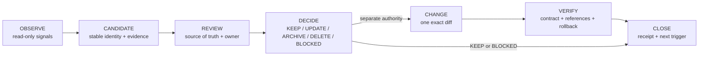

# Repository Hygiene Lifecycle for Coding Agents

- Research status: **source-backed synthesis; repository facts refreshed and
  independently reviewed control corrections incorporated**
- Original research date: 2026-08-11
- Repository refresh: 2026-08-12
- Original research tree: `4217fa71e61889a131d239aad319652b61086f88`
- Current verification tree: `83d3783c6d3d0ced6bced4c93972170c6abfdae1`
- Run: `20260811T204249Z-repository-hygiene`
- Scope: long-lived hygiene for code, dependencies, tests, scripts, workflows,
  documentation, ADR/proposal status, release instructions, architecture
  baselines, and generated or local artifacts
- Out of scope: implementing checks, deleting or moving files, changing CI,
  installing tools, committing, publishing, or releasing

## Research question

How can Goalrail keep a repository clean over time without allowing coding
agents to turn weak staleness signals into dangerous automatic deletion?

This report separates:

- **Source-backed facts**: claims checked against the repository, a live public
  Goalrail target, or upstream primary documentation.
- **Synthesis**: the proposed Goalrail lifecycle. It is not implemented and its
  operating cost has not been measured.

## Executive summary

Repository hygiene should be an **evidence and decision lifecycle**, not a
cleanup command. Deterministic checks should only create or update a candidate
queue. A human or authority-bounded agent then reviews each candidate against
its real source of truth and chooses `KEEP`, `UPDATE`, `SUPERSEDE_OR_ARCHIVE`,
`DELETE`, or `BLOCKED`. Any mutation is a later, separately authorized change
with an exact diff, rollback, and targeted verification.

Five design choices matter most:

1. **Ignore is not ownership.** An ignored path can be generated, valuable local
   state, private configuration, or an accident. Git cannot restore an ignored
   file that it never tracked.
2. **Tools nominate; reviewers decide.** Compiler lints, unused-dependency
   scanners, mutation testing, static analyzers, link checkers, reference maps,
   and revisit-trigger checks each prove a narrow observation. None proves
   semantic obsolescence or deletion safety.
3. **Use triggers, not a permanent broad CI gate.** Run cheap, stable checks on
   relevant changes. Run one bounded relation review at milestone closure,
   release preparation, a crossed revisit trigger, or baseline replacement.
   Trial network-sensitive or heuristic checks outside blocking CI first.
4. **Ratchet baselines in two layers.** First report added, removed, and changed
   observations. Then review whether they represent new, resolved, carried, or
   no semantic concern. `NO_CHANGE` means only that observed identities match.
5. **Reuse mature detectors; keep glue narrow.** Goalrail-specific code is
   justified only for its metadata schema, source-of-truth relations, release
   contract tokens, and baseline receipts. It should not reimplement language
   analysis or add an automatic deletion engine.

## Verified Goalrail findings

These are verified findings and their current owner-reviewed dispositions. They
do not authorize automatic cleanup actions.

| Artifact | Verified observation | Candidate disposition | Confidence |
| --- | --- | --- | --- |
| [`ARCHITECTURE.md`](../../ARCHITECTURE.md) | The previous `AD-6 remediation in progress` wording was replaced. The header now says the assessment boundary is enforced and remaining stages are review-only; the conformance section still honestly marks the complete AD-6 graph `REVIEW`. | `RESOLVED_OBSERVATION` / `NO_CONCERN`: keep the current explicit wording. | High |
| [Decision 0002](../decisions/0002-make-lifecycle-agent-first.md) | Goalrail-rs [v0.3.6 is publicly released](https://github.com/heurema/goalrail-rs/releases/tag/v0.3.6) with macOS, Linux, and Windows assets; Homebrew remains the only managed package lifecycle. Its operational status now records that boundary. | `CLOSED_UPDATE`: retain the adopted decision and verified release state without claiming Linux or Windows package ownership. | High |
| [Decision 0003](../decisions/0003-use-local-verification-receipts-for-push.md) | The three-push revisit count crossed. The owner selected `KEEP`; the decision records that public events cannot prove local hook use and that cost remains unquantified. | `CLOSED_KEEP`: retain the fail-fast validation policy and reopen on a false accept, false reject, confusing recovery path, or material cost complaint. | High for the crossed count; medium-high for disposition |
| [Decision 0012](../decisions/0012-build-native-multi-platform-release-bundles.md) | [Run 31572166805](https://github.com/heurema/goalrail-rs/actions/runs/31572166805) passed all six jobs for exact source `83d3783c...`, and the resulting [v0.3.6 release](https://github.com/heurema/goalrail-rs/releases/tag/v0.3.6) was published with the exact 11-asset set. The decision now records both facts. | `CLOSED_UPDATE`: repeat-canary and publication verification are closed without conflating them with Homebrew promotion. | High |
| [Model behavior evaluation proposal](../ideas/model-behavior-evaluation.md) | The original third-crate trigger crossed, but no named existing consumer or real receipt-backed comparison case exists. | `CLOSED_DEFER`: reopen only when both exist; archive by default on 2027-02-12 if they do not. | High |
| [`DESIGN.md`](../../DESIGN.md) and [`PRODUCT.md`](../../PRODUCT.md) | Both are site-scoped and were introduced with `gr-site`. They now appear in the [README design-document index](../../README.md#design-documents) with explicit public-site scope. | `CLOSED_INDEX`: retain the root files and resolve discoverability without a risky move. | High |
| [Repository script inventory](script-entrypoint-inventory.md) | All 27 tracked executable shell entrypoints have a repository-owned caller or entrypoint through `mise`, workflows, Docker, hook setup, tests, or another active script. | `CLOSED_NO_CANDIDATE`: keep the current set; repeat only when an entrypoint or its last reference changes. | High, tree-scoped |
| `.idea`, `.claude`, `dist`, `target` | [`target`, `dist`, and `.idea`](../../.gitignore) are repository-ignored. `.claude/settings.local.json` is ignored only through the user's global Git exclude. None of the four paths was tracked or present in this worktree at scan time. | `KEEP_NO_DELETE`: classify regeneration/ownership before any future cleanup. | High, time-scoped |
| [Architecture drift baseline](../../architecture/drift/baseline.json) | The accepted snapshot currently includes `skills.rs` at 2,907 lines and `use_case.rs` at 1,215 lines. The owning [decision](../decisions/0009-trial-identity-based-architecture-drift.md) correctly says `NO_CHANGE` is not architecture conformance. The concentrations are review signals, not proven debt. | `KEEP_WITH_RATCHET_RECEIPT`: preserve the useful identity signal and make carried concerns visible when accepting a new baseline. | High |
| [Release instructions](../release.md) | The previous README duplication was removed. `docs/release.md` now declares itself the canonical stage order, README is a summary, and focused run/release checkers plus sabotage tests validate identities and the exact asset contract. | `RESOLVED_OBSERVATION` / `KEEP`: preserve one runbook and its narrow checks; no Runme gap is currently demonstrated. | High |

## What primary sources establish

### Git safety boundary

[Git's ignore documentation](https://git-scm.com/docs/gitignore) states that
ignore rules describe intentionally untracked files and do not affect already
tracked files. Effective ignore rules can come from several sources, including
repository `.gitignore`, `$GIT_COMMON_DIR/info/exclude`, and a user-level
`core.excludesFile`.

[git check-ignore](https://git-scm.com/docs/git-check-ignore) can report the
matching source, line, pattern, and path. This is the correct deterministic
signal for “why is this path ignored?” It still says nothing about who owns the
file or whether it is recoverable.

[git clean](https://git-scm.com/docs/git-clean) provides dry-run and interactive
selection and requires force by default for deletion. `-X` selects ignored
files only. These are useful inventory and preview mechanics, not evidence that
deletion is safe. [git restore](https://git-scm.com/docs/git-restore) can restore
tracked paths from a Git source, and [git revert](https://git-scm.com/docs/git-revert)
can record a reversing commit. Neither can recover untracked local state that
was never captured elsewhere.

### Deterministic detectors have narrow claims

- The Rust compiler's [`dead_code` lint](https://doc.rust-lang.org/rustc/lints/listing/warn-by-default.html#dead-code)
  detects unused, unexported items. It does not establish that exported,
  configured, dynamically reached, or product-level behavior is obsolete.
- [cargo-machete](https://github.com/bnjbvr/cargo-machete) detects suspect unused
  Cargo dependencies and documents false positives and a Cargo-metadata mode.
  A finding requires review.
- [cargo-udeps](https://github.com/est31/cargo-udeps) is a corroborating
  compiler-artifact-based option, but it requires nightly to run and explicitly
  says it can miss unused crates.
- [cargo-mutants](https://github.com/sourcefrog/cargo-mutants) measures whether
  tests detect selected behavior changes, not merely whether code executed. It
  can reveal weak tests; it cannot decide whether a behavior or test is still a
  valid product contract.
- [ShellCheck](https://github.com/koalaman/shellcheck) finds shell syntax,
  correctness, robustness, and portability issues. It cannot tell whether a
  script is still an entry point.
- [actionlint](https://github.com/rhysd/actionlint) checks GitHub Actions syntax,
  expressions, reusable workflow interfaces, and embedded scripts. It cannot
  prove live runner behavior, public state, repository permissions, or prose
  consistency.
- [lychee](https://github.com/lycheeverse/lychee) checks links in Markdown and
  HTML and supports offline mode, exclusions, fragments, and caching. A
  reachable link can still point to obsolete guidance; remote checks can also
  be noisy because of rate limits, authentication, or transient failures.

### Decision records need explicit terminal relations

[adr-tools](https://github.com/npryce/adr-tools) supports creating a new ADR that
supersedes an older ADR and updates the older record's status. The
[MADR template](https://github.com/adr/madr/blob/main/template/adr-template.md)
uses an explicit status field with values such as proposed, rejected, accepted,
deprecated, and superseded. These practices preserve history while ensuring
that old records no longer masquerade as current instructions.

### Baselines work only as ratchets

[ArchUnit's FreezingArchRule](https://www.archunit.org/userguide/html/000_Index.html#_freezing_arch_rules)
records existing violations, reports new violations on later runs, and removes
fixed violations from the stored set so they cannot return silently. It can
forbid baseline creation or updates in CI. Its broad “refreeze everything”
operation accepts all current violations and reports success, so it is explicit
and disabled by default.

The transferable practice is not the Java tool itself. It is the control model:
new debt is visible, fixed debt ratchets away, and accepting current debt is a
separate reviewed action.

## Synthesis: the lifecycle



### 1. Deterministic observation

Observation is read-only and produces facts, not verdicts. A useful scan may
collect:

- tracked, untracked, and ignored path identities;
- effective ignore source and pattern;
- files changed since the last reviewed hygiene receipt;
- compiler unused/dead-code diagnostics for the relevant configuration;
- unused-dependency candidates from a separately fit-tested tool;
- mutation misses and untested behavior from existing verification;
- shell/workflow static diagnostics;
- broken local links and separately classified remote-link failures;
- inbound repository references for scripts and documents;
- ADR/proposal status, last-verified value, and machine-checkable revisit date
  or count trigger;
- drift-baseline additions, removals, and carried observations;
- release-task names, workflow inputs, artifact patterns, and duplicated tokens
  in operator docs.

Age, a zero repository reference count, or a path being ignored must never be a
standalone deletion signal.

### 2. Stable candidate receipt

Each candidate needs stable identity so repeated scans update one item instead
of producing recurring noise.

```json
{
  "candidateId": "decision:0002:publication",
  "artifact": {
    "kind": "decision",
    "logicalId": "0002",
    "pathHint": "docs/decisions/0002-make-lifecycle-agent-first.md"
  },
  "detector": "goalrail/status-trigger",
  "claimScope": "declared operational status differs from public evidence",
  "observation": "status says publication pending",
  "evidence": [
    "local file and line",
    "canonical live target and observed time"
  ],
  "sourceOfTruth": "public goalrail-rs release state",
  "suggestedDisposition": "UPDATE",
  "confidence": "high",
  "recoveryAssessment": {
    "class": "tracked_git",
    "evidence": "artifact exists in the reviewed tree"
  }
}
```

A candidate receipt should record:

- durable domain identity plus the current path as a hint;
- tracked/ignored state and ignore provenance when relevant;
- detector and its claimed scope;
- inbound references and entry points checked;
- authoritative owner/source of truth;
- observation time for live evidence;
- proposed disposition and confidence;
- recovery class and its evidence;
- prior candidate identity, so unchanged findings are suppressed.

The detector receipt contains no mutation authorization. A move or rename uses
an explicit `REANCHOR` receipt linking the prior and current path hints. A
content hash may corroborate that relation, but cannot be the durable identity
because an ordinary edit changes it. Ambiguous re-anchors are `BLOCKED`.

### 3. Review semantics

Review asks different questions for different artifact classes:

- **Code:** Is the behavior reachable in every supported feature/target? Is it a
  public compatibility surface? Which contract or caller owns it?
- **Tests:** Does the test protect a current behavior, a historical regression,
  or an implementation detail already removed? Would deleting it weaken
  mutation evidence?
- **Scripts/workflows:** Is there an operator, hook, task-runner, CI, release, or
  external entry point not visible through repository references?
- **Docs:** Does the document own a current contract, preserve rationale, or
  merely duplicate another source? Are its commands and links verified against
  the live target?
- **ADR/proposal:** Is the decision still current, superseded, rejected, or due
  for a triggered owner decision? Operational progress must not be compressed
  into the decision status.
- **Ignored/local files:** Is there a documented generator and regeneration
  proof? Could the file contain user state, credentials, IDE configuration, or
  agent state that Git cannot recover?

Material or destructive dispositions require an independent review of the
aggregate diff. Ambiguity returns `BLOCKED`; it is not permission to choose the
most aggressive cleanup.

### 4. Decision and rollback contract

| Decision | Meaning | Minimum evidence | Rollback |
| --- | --- | --- | --- |
| `KEEP` | Current, uniquely useful, or not safely classifiable. | Retention reason and next trigger. | None required; no mutation. |
| `UPDATE` | Still owns a live contract, but its facts/status/commands drifted. | Authoritative replacement facts and live verification. | Restore prior tracked content or revert the focused commit. |
| `SUPERSEDE_OR_ARCHIVE` | No longer current, but preserves rationale or historical evidence. | Successor/terminal status, index changes, and proof it is absent from live instructions. | Restore path/link; revert focused commit. |
| `DELETE` | Redundant or generated, no unique historical value, no live inbound dependency, and recoverable. | Exact candidate receipt, owner approval, reference/entry-point checks, and targeted verification plan. | Tracked: recorded inverse diff or Git revert. Untracked: only a successfully demonstrated regeneration path; otherwise `BLOCKED`. |
| `BLOCKED` | Ownership, current use, source of truth, privacy, or recovery is ambiguous. | Missing fact and one answerable owner question. | None; no mutation. |

For ADRs, “archive” normally means a terminal status and successor link while
remaining in the decision collection. Moving a decision to history is useful
only if current indexes and inbound links remain unambiguous. Do not rewrite an
accepted historical decision merely to make it read like the current system.

Recovery has only three accepted classes:

- `tracked_git`: record the exact inverse diff or revert path;
- `regenerable_with_proof`: name the generator, inputs, and verification, and
  successfully reproduce the exact artifact before removal;
- `unknown`: no tested restoration path exists, so the disposition is
  `BLOCKED`.

Declaring a path “generated” is not recovery evidence. Ignored `.idea` and
`.claude` state is `unknown` by default. `dist` or `target` may become
`regenerable_with_proof` only for an exact artifact after the real generator and
verification path succeed.

### 5. Separate mutation authority

The hygiene run ends after review recommendations. A later task may receive
authority for one exact state-changing slice. That task should:

1. freeze the reviewed source tree and candidate set;
2. state exact paths and dispositions;
3. obtain explicit owner approval when the action is destructive or externally
   visible;
4. apply one focused diff without automatic fallback or retry;
5. run targeted and regression verification;
6. independently review material aggregate changes;
7. record the rollback and final receipt.

No scanner, scheduled job, CI check, or coding agent should own an automatic
`DELETE` transition.

## Signal and tooling map

The following are adoption candidates, not installation recommendations. Each
new tool still needs a bounded Goalrail fit trial and a pinned version.

| Artifact class | Prefer | Proven signal | Blind spot | Suggested operating mode |
| --- | --- | --- | --- | --- |
| Rust code | Existing rustc/Clippy lints | Compiler-observed unused private items and configured lint failures. | Product relevance, exported/dynamic use, unsupported feature sets. | Keep in existing local CI where already trusted. |
| Cargo dependencies | Existing Cargo/source evidence first; evaluate one mature scanner only after a demonstrated gap | Suspect unused dependencies under the selected tool's model. | False positives, target/build/macro use, and product intent. | No canary selected yet; any future run is report-only and never auto-fix. |
| Tests | Existing targeted tests, coverage, and diff-scoped `cargo-mutants` | Execution and whether tests detect selected behavior changes. | Whether the behavior/test is still required; duplicate tests. | Keep existing milestone verification; review obsolescence manually. |
| Shell scripts | Existing `sh -n`, pinned ShellCheck, and repository reference map | Syntax/static defects and known inbound references. | External/manual entry points and semantic ownership. | Static checks on touched scripts; reference map advisory. |
| GitHub Actions | Trial pinned actionlint plus existing sabotage/contract tests | Syntax, expressions, interfaces, selected policy invariants. | Live permissions, runner behavior, public state, prose consistency. | Change-gated after canary; live smoke remains separate. |
| Markdown/HTML links | Local target validation; trial lychee | Missing local targets and configured remote failures. | Semantic freshness; remote auth/rate-limit noise. | Local paths change-gated; remote links scheduled/advisory. |
| ADR/proposal status | Goalrail metadata schema and trigger evaluator | Missing/invalid fields and crossed machine-readable triggers. | Correct semantic disposition. | Narrow project glue; candidates only. |
| Release docs | One canonical runbook plus checks against `mise` task keys, workflow inputs, and artifact tokens | Named interface drift. | Whether a public operation is authorized or succeeded. | Required at release preparation; no command execution by doc test. |
| Ignored/local artifacts | Git status/check-ignore; clean dry-run only as preview | Presence, tracked state, and ignore provenance. | Ownership, value, privacy, recoverability, safe deletion. | Report only; local state defaults to `BLOCKED`. |
| Architecture baseline | Existing drift snapshot plus reviewed two-layer ratchet receipt | Added, removed, and changed observed identities. | Whether an observation represents a new, resolved, carried, or absent concern. | Manual milestone/aggregate review, outside normal CI. |

## Cadence without permanent noisy CI

### Event-triggered checks

| Trigger | Scope | Blocking policy |
| --- | --- | --- |
| A source/test/script/workflow is touched | Existing deterministic compiler, test, syntax, and contract checks for the changed owner. | Block only on already trusted deterministic checks. |
| Milestone closure | Candidate scan for newly orphaned files, stale descriptions of the changed contract, and status/revisit updates. | Review evidence; no deletion. |
| Release preparation | Canonical release runbook, task/workflow inputs, current version tokens, artifact names, rollback, and live release status. | Required targeted review. |
| ADR/proposal revisit date or count fires | Only the owning record and evidence needed for its owner disposition. | Owner decision required; unrelated work need not be blocked. |
| Baseline replacement is proposed | Observation delta plus reviewed concern dispositions. | Owner-gated. Normal CI never writes or accepts the baseline. |
| Material false positive/negative occurs | The exact detector claim and its fixtures. | Stop trusting the affected detector until corrected or removed. |

### No periodic broad review yet

The first manual audit reviewed the 12 decisions and current proposal on
2026-08-12. It nominated four candidates: decisions 0002, 0003, and 0012 plus
the crossed model-behavior proposal trigger. The owner closed all four through
one documentation-only governance diff. The other nine records produced no
candidate, and the audit added no checker or mutation authority.

Do not schedule a repository-wide heartbeat from one successful audit. Repeat
only one named relation after a relevant event. Before each run, cap it at ten
candidates and 30 minutes of owner review. Add an automatic trigger only if the
same relation recurs and the receipts are useful; remove a canary after three
bounded non-value runs.

Noise controls:

- stable candidate IDs and explicit observation/concern dispositions;
- do not re-report unchanged accepted items as new findings;
- no LLM heartbeat when deterministic comparison suffices;
- online link failures remain advisory until classified and reproduced;
- hard ceilings: one scan, one review round, no automatic second milestone;
- stop on `NO_CHANGE`, a conclusive disposition, or an owner gate.

## Preventing baselines from hiding accumulated debt

Goalrail's current drift design already has two strong protections: capture does
not accept, and `NO_CHANGE` explicitly does not claim conformance. Add a ratchet
receipt around baseline replacement without creating a second architecture
source of truth.

For every proposed baseline update:

1. Compare the accepted baseline, current observation, and pre-change tree.
2. Identity-match the mechanical layer and emit `ADDED_OBSERVATION`,
   `REMOVED_OBSERVATION`, or `CHANGED_OBSERVATION`.
3. Review each delta against its owning rule or decision and classify it as
   `NEW_CONCERN`, `RESOLVED_CONCERN`, `CARRIED_CONCERN`, or `NO_CONCERN`.
4. Never infer `RESOLVED_CONCERN` from a removed file, edge, symbol, or version.
5. Fail closed or require an explicit `REANCHOR` when identity matching is
   ambiguous.
6. Permit a proposed deletion-only baseline diff only after semantic review;
   the check does not apply or accept it.
7. Require a reviewed owner decision for additions, growth, or broad refreeze.
8. Keep concern ownership and rationale in the existing decision or
   `docs/trials.md`, not a parallel generic debt database.
9. Report carried-concern age and count, and say “observations unchanged” or
   “reviewed drift accepted”; never “architecture clean”.

For the current baseline, large-file entries are context. They are not debt
until a review ties them to a violated ownership rule or a concrete maintenance
failure. If review does accept one as debt, the owning trial should record why,
who owns it, and when it must be revisited; replacing the JSON snapshot must not
erase that obligation.

## Goalrail-specific target state

### Status model

Use separate fields instead of compound prose:

```text
Decision: accepted | proposed | rejected | superseded | deprecated
Implementation: not_started | in_progress | implemented | removed
Verification: unverified | review | pass | needs_fix | blocked
Last verified: YYYY-MM-DD
Revisit: machine-readable date/count/condition plus owner
```

This would let decision 0012 remain `accepted` while truthfully recording
implemented tooling and a passing repeat canary without turning operational
progress into decision status. `ARCHITECTURE.md` already demonstrates the
separation: the decision is adopted, one assessment boundary is enforced, and
the remaining AD-6 stage graph stays `review`.

### Documentation ownership and indexing

The owner selected the smallest treatment for `DESIGN.md` and `PRODUCT.md`:
keep both at the root and list them in README with explicit public-site scope.
Do not add aliases or moved copies. Reopen only when a concrete ownership or
discoverability problem appears; the resolved indexing gap does not justify
relocation.

### Generated versus local ignored paths

Classify ignored paths by regeneration and ownership, not by pattern alone:

- `target/`: Cargo-owned and reproducible from tracked source/toolchain inputs;
- `dist/`: release-tool-owned and reproducible only when its exact source,
  toolchain, and packaging inputs remain available;
- `.idea/`: local IDE state, not automatically disposable;
- `.claude/settings.local.json`: local agent configuration ignored by a global
  rule on this machine, not a repository-wide cleanup contract.

If this distinction becomes project policy, encode it in repository-visible
documentation or comments. Do not rely on one user's global Git excludes to
communicate it.

### Release instruction ownership

Keep [one canonical operator flow](../release.md). The current repository makes
`docs/release.md` the stage-order owner and keeps README as a summary. Focused
checkers verify the selected workflow run, remote tag/source binding, exact
asset names, sizes, and GitHub-reported digests. Those checks provide evidence;
they do not authorize `git push`, workflow dispatch, tag creation, release
publication, `main` promotion, or Homebrew mutation.

Version-specific examples should either be deliberately current and checked
against the workspace version, or use one consistent placeholder. Live success
claims require observed run/release evidence with a timestamp; a green local
script is not publication evidence.

## Smallest useful canary

The smallest canary has now run manually: one read-only decision/proposal
relation audit, with no new repository code or CI. Its four candidates were
closed through deterministic document updates and owner dispositions; they do
not justify a checker yet.

Only if the same status/revisit failure recurs should one narrow checker be
proposed. It must pass a positive
fixture, a negative fixture, and a sabotage case, and expose only `NO_CHANGE`,
`REVIEW`, or `BLOCKED`. It gets no `--fix`, `--accept`, `--archive`, or
`--delete` path. Other relation types and external tools remain deferred until
a measured gap names them.

## Tradeoffs and disagreements

- **Archive versus leave in place:** ADR practice favors retaining superseded
  decisions with explicit links. Moving every old document to history can break
  references and create a second taxonomy. Archive only when the document is
  not itself part of the decision sequence.
- **Blocking CI versus scheduled review:** Blocking checks prevent immediate
  regression but accumulate noise when they depend on networks, heuristics, or
  semantic ownership. Goalrail should promote a check to blocking only after a
  bounded trial proves a narrow claim and acceptable false-positive cost.
- **Generic tools versus glue:** Mature analyzers reduce language-analysis risk,
  but no generic tool knows Goalrail's ADR trigger, release authority boundary,
  document ownership, or baseline acceptance semantics. That small semantic
  layer is legitimate project-specific glue when its claim is explicit and
  sabotage-tested.
- **Deletion versus history:** Keeping everything creates discovery cost; deleting
  everything that looks unused destroys rationale and local state. Explicit
  terminal statuses and indexes remove obsolete material from the live path
  while preserving only evidence with durable value.

## Verification status and confidence

Repository-specific facts were refreshed on exact tree `83d3783c...` and
checked against the successful public native run and `v0.3.6` release. The
control model incorporates the material findings from the independent review
recorded in the companion modern-landscape report.

- **High confidence:** Git safety semantics; upstream tool scopes; ADR
  supersession; baseline ratchet mechanics; all listed local Goalrail findings.
- **Medium confidence:** the lifecycle fits Goalrail's authority and trial model,
  and the manual decision/proposal audit found and closed four actionable
  candidates, but no implementation or longitudinal maintenance-cost evidence
  exists.
- **Low until a demonstrated gap:** the net benefit of any new dependency
  scanner, workflow linter, executable-doc tool, or remote link checker here.

The single research sub-agent confirmed the primary-source set but did not
return its structured payload before the run ceiling. No second agent or second
research round was started; the orchestrator independently fetched and verified
the material source claims. This lowers process completeness, not the confidence
of claims marked verified.

## Open owner questions

None from this bounded audit. Future missing-reference findings remain
`BLOCKED` when manual or external ownership cannot be established.

## Sources

### Primary and upstream

- [Git: gitignore](https://git-scm.com/docs/gitignore)
- [Git: git-check-ignore](https://git-scm.com/docs/git-check-ignore)
- [Git: git-clean](https://git-scm.com/docs/git-clean)
- [Git: git-restore](https://git-scm.com/docs/git-restore)
- [Git: git-revert](https://git-scm.com/docs/git-revert)
- [Rust compiler: dead_code lint](https://doc.rust-lang.org/rustc/lints/listing/warn-by-default.html#dead-code)
- [cargo-machete](https://github.com/bnjbvr/cargo-machete)
- [cargo-udeps](https://github.com/est31/cargo-udeps)
- [cargo-mutants](https://github.com/sourcefrog/cargo-mutants)
- [ShellCheck](https://github.com/koalaman/shellcheck)
- [actionlint](https://github.com/rhysd/actionlint)
- [lychee](https://github.com/lycheeverse/lychee)
- [adr-tools](https://github.com/npryce/adr-tools)
- [MADR template](https://github.com/adr/madr/blob/main/template/adr-template.md)
- [ArchUnit: Freezing Arch Rules](https://www.archunit.org/userguide/html/000_Index.html#_freezing_arch_rules)

### Goalrail evidence

- [`ARCHITECTURE.md`](../../ARCHITECTURE.md)
- [Decision 0002](../decisions/0002-make-lifecycle-agent-first.md)
- [Decision 0003](../decisions/0003-use-local-verification-receipts-for-push.md)
- [Decision 0009](../decisions/0009-trial-identity-based-architecture-drift.md)
- [Decision 0012](../decisions/0012-build-native-multi-platform-release-bundles.md)
- [Model behavior evaluation proposal](../ideas/model-behavior-evaluation.md)
- [`docs/trials.md`](../trials.md)
- [Architecture drift baseline](../../architecture/drift/baseline.json)
- [Canonical release runbook](../release.md)
- [Release workflow](../../.github/workflows/release.yml)
- [Release tooling tests](../../scripts/test-release-tooling.sh)
- [Public Goalrail-rs releases](https://github.com/heurema/goalrail-rs/releases)
- [Verified release v0.3.6](https://github.com/heurema/goalrail-rs/releases/tag/v0.3.6)
- [Successful native workflow run 31572166805](https://github.com/heurema/goalrail-rs/actions/runs/31572166805)
- [GitHub repository events API](https://api.github.com/repos/heurema/goalrail-rs/events)
